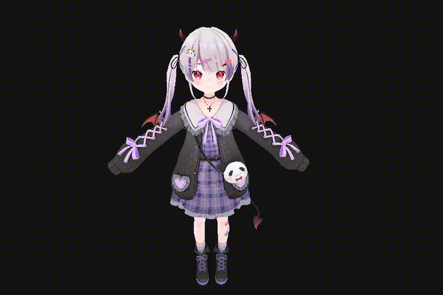

# 3D Model Viewer using RAYLIB and C
This side project is a lightweight 3D model viewer and Renderer that can export a turntable render of a given 3d model from the current 
camera view this project only supports gltf and obj at the moment and it uses uses FFmepg for mp4 h264  conversion 

</img>
<h2>🔧 Dependencies</h2>
<ul>
  <li><strong>Raylib</strong> - A simple and easy-to-use library to enjoy videogames programming. <a href="https://www.raylib.com" target="_blank">Visit Raylib Website</a></li>

  <li><strong>Make</strong> - Standard build automation tool for compiling the project. <a href="https://www.gnu.org/software/make/" target="_blank">Visit Make Website</a></li>

<li><strong>FFMPEG</strong> - A complete, cross-platform solution to record, convert and stream audio and video.. <a href="https://www.ffmpeg.org/" target="_blank">Visit Make Website</a></li>
</ul>
